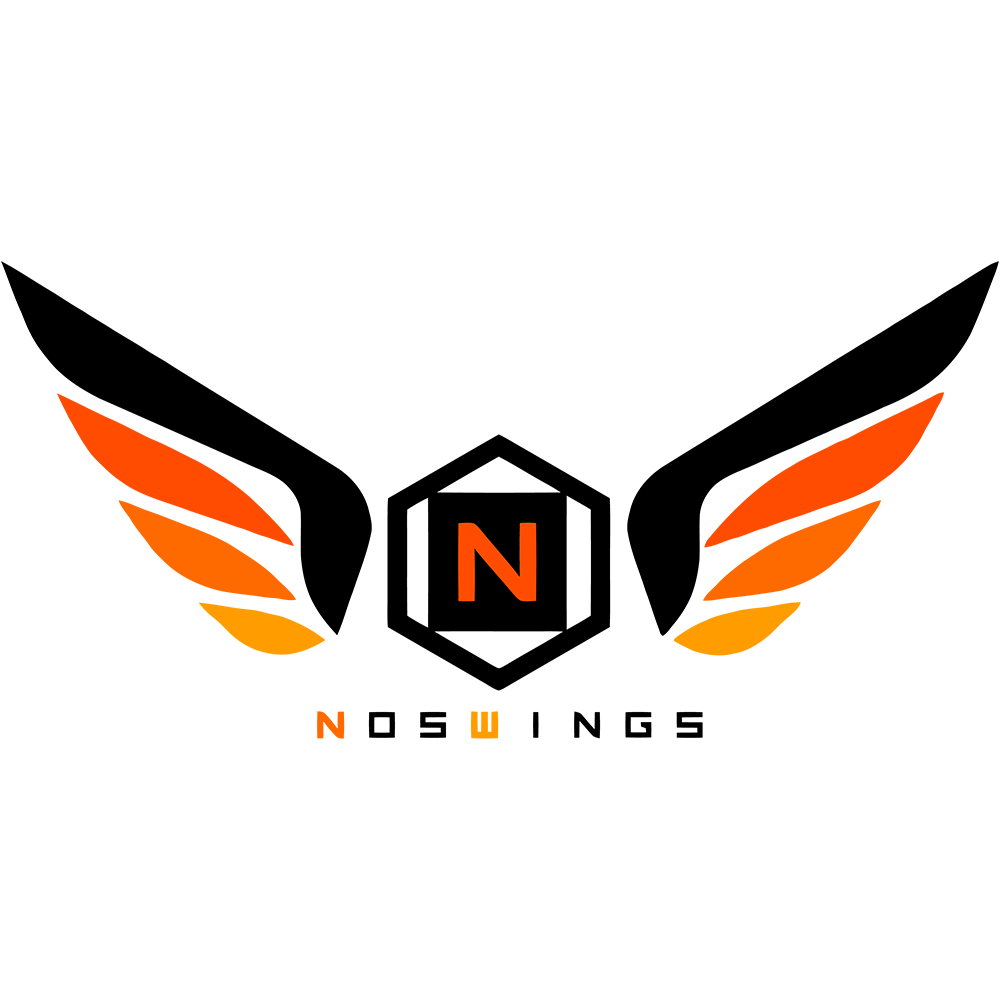

<b>ON.NosWings</b>
   
  NosWings Developers
   
  
   

  

ON.NosWings is our old OpenNos fork to get NosWings server running.

This project is not production ready nor maintained anymore.

# Follow our new project : [ChickenAPI](https://github.com/BlowaXD/ChickenAPI)

## Who are we 

We are a bunch of enthusiast who decided to make their own fork of OpenNos, modifying a lot of things designed for our needs.

## Why don't we maintain OpenNos ?

As we've already told numerous time, OpenNos has proven its capacity and its limitation.

We are in 2018, our needs are not the same as at the beginning of OpenNos, that's why we decide to use more recent technologies and Cloud Native ready implementations

## Wanna thank us for our work ?

If you wanna thank us, come take some mins on [ChickenAPI's Discord](https://discord.gg/HnTx5wN) !

## Do not forget !

Please, do not forget to mention that you are using someone's work.